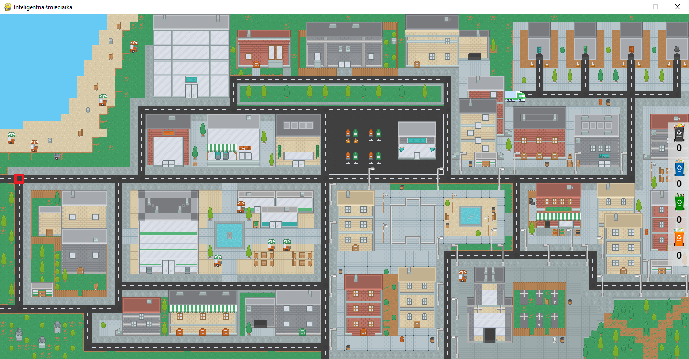
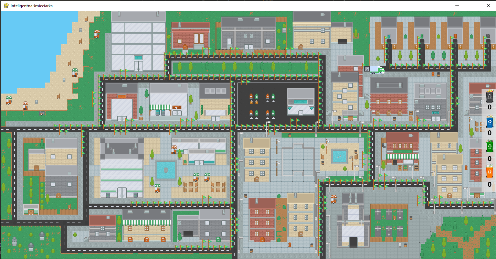

# Prezentacja postępów – planowanie ruchu - BFS
**Temat:** Inteligentna śmieciarka

**Zespół:** Maciej Barabasz, Adam Hącia, Marcin Krupiński, Kajetan Gałęziowski 

**Przyrost:** Strategie przeszukiwania
## Wstęp
Zgodnie z obraną konwencją, nasza śmieciarka działa w następujący sposób:
- śmieciarka przebywa na wysypisku
- śmieciarka otrzymuje zlecenie na odbiór śmieci
- śmieciarka najkrótsza możliwą drogą jedzie odebrać śmieci
- śmieciarka zbiera śmieci
- jeśli śmieciarka jest pełna – kieruje się na wysypisko w celu posegregowania śmieci i opróżnienia (logika wysypiska i opróżniania zostanie zgłębiona przy metodach nauczania)
- jeśli śmieciarka ma jeszcze miejsce to otrzymuje z centrali zlecenie na kolejny odbiór śmieci i natychmiastowo schemat się powtarza 

Zatem śmieciarka za każdym razem wie gdzie ma jechać, ponieważ otrzymuje zlecenie odbioru w konkretnym miejscu. Nie wie jednak w momencie otrzymania zlecenia jaką drogą powinna jechać – w tym miejscu pojawia się planowanie ruchu.

## Akcje
Nasza śmieciarka w takim wypadku ma ograniczone i jasno określone akcje.
- 1 – przesunięcie o jedno pole w górę
- 2 – przesunięcie o jedno pole w dół
- 3 – przesunięcie o jedno pole w lewo
- 4 – przesunięcie o jedno pole w prawo
- 5 – zbierz śmieci
- 6 – wysyp śmieci (wątek tej akcji będzie rozwinięty przy metodach nauczania)

Śmieciarka zawsze porusza się przodem tj. jeśli poruszyła się o jedno pole w prawo po czym o jedno pole w lewo to jest to równoznaczne z tym, że zawróciła, a nie wykonała ten ruch na wstecznym 😊.

Przy samym planowaniu ruchu akcję 6 można na razie pominąć. W zamyśle akcja ta będzie zachodzić tylko w momencie kiedy śmieciarka zjedzie na wysypisko z racji zapełnienia i wystąpi maksymalnie cztery razy z racji, że śmieci są segregowane do czterech kontenerów. Samo planowanie ruchu będzie potrzebne, aby do tych kontenerów dojechać.

Podobnie jest z akcją 5. Zachodzi ona zdecydowanie częściej ale również tylko w jasno określonym momencie – kiedy śmieciarka dojedzie pomyślnie do miejsca odbioru śmiecia określonego w zleceniu. Zatem przy planowaniu ruchu nie musimy tej akcji uwzględniać, ponieważ zajdzie ona dopiero gdy strategia poruszania się do śmiecia zostanie ustalona i zrealizowana, nigdy w innym przypadku.

## Założenia:
**States:** lokalizacje śmieciarki

**Actions:** [akcje](#Akcje)

**Goal test:** dojechanie do lokalizacji ze zlecenia odbioru śmieci

**Path cost:** 1 dla akcji

## Strategia przeszukiwania - BFS - Breadth-first search
#### Kilka słów o BFS:
- niepoinformowana strategia przeszukiwania
- algorytm przeszukiwania wszerz 
- pozwala na odnalezienie najkrótszej ścieżki 

Każdy ruch (akcja) agenta na dwuwymiarowej kracie po której się porusza, niesie za sobą zmianę stanu, w którym się znajduje.

#### Implementacja algorytmu:
```
    def BFS(self, start, goal):
        print("[ ALGORITHM LOG ] INSIDE BFS")
        queue = [ [start] ]
        visited = set()

        while queue:
            # first path in queue
            search_path = queue.pop(0)
            # last point in path
            current_point = search_path[-1]

            # check if we reached goal
            if current_point == goal:
                return search_path

            # check if current_point was already visited
            if current_point not in visited:
                # iterate over neighbours (possible actions) of current_point (current state) and construct new path which is new state 
                for neighbour in current_point.neighbours:
                    new_path = list(search_path)
                    new_path.append(neighbour)
                    queue.append(new_path)

                    # if one of our neighbours is goal, we can end and return path already, we know what actions we have to take in order to find state which we want
                    if neighbour == goal:
                        return new_path

                # mark visited point
                visited.add(current_point)
```
#### Metoda collect():
```
    def collect(self):
        # get number of trashes to collect
        trash_count = TRASH_COUNT
        # get trash places
        trash_places = self.map.generate_trashes()
        # while there are trashes to collect, take one by one and collect
        while trash_count != 0:
            # first trash from list
            temp_trash_point = trash_places[0]
            # get from current points_grid
            temp_trash_point = self.points_grid[temp_trash_point.y][temp_trash_point.x]
            # draw that trash
            temp_trash = Trash(self.game, temp_trash_point)
            # control
            print("I am on my way to collect trash !")
            # run algorithm to find path to that trash
            path_to_trash = self.searching_algorithm(self.points_grid, self.point, temp_trash_point)
            # run drive to that trash
            self.drive(path_to_trash)
            # collect trash
            trash_count = trash_count - 1
            # remove trash from list
            trash_places.remove(trash_places[0])
            # remove trash from map
            temp_trash.deleteTrash()
            print("Trash is collected! There are " + str(trash_count) + " left!")
        # after this while loop we are going back to the garbage dump but we already find spots for next trashes
        # after this call, under the self.map.trash_places is new list of trashes
        self.map.generate_trashes()
        # move our garbage truck to dump
        # get dump tile point
        dump_point = self.points_grid[DUMP_TILE_Y][DUMP_TILE_X]
        # call algorithm to dump and find path
        path_to_dump = self.searching_algorithm(self.points_grid, self.point, dump_point)
        # drive to that point
        self.drive(path_to_dump)
```

#### Metoda drive(path):
```
    def drive(self, path):

        if not path:
            print("There is no possible road ! ")
            return

        current_point = path[0]
        path.remove(current_point)

        for point in path:
            dy = point.y - current_point.y
            dx = point.x - current_point.x
            current_point = point
            self.move(dx, dy)
            self.update()
            pygame.event.pump()
            time.sleep(TRUCK_SPEED)
            self.game.update()
            self.game.draw()
```
#### Metoda wyboru strategii przeszukiwania:
```
    def searching_algorithm(self, points_grid, current_point, goal_point):

        if not self.game.algorithm:
            path = self.roads_graph.BFS(current_point, goal_point)
        else:
            path = self.roads_graph.A_star(points_grid, current_point, goal_point)

        # LOG
        print("[ ALGORITHM LOG ] PATH FOUND BY ",end="")
        if not self.game.algorithm:
            print("BFS")
        else:
            print("A*")

        return path
```

#### Przebieg algorytmu:
- korzysta się z listy reprezentującej kolejkę ścieżek
- korzysta się ze zbioru reprezentującego odwiedzone pola (możliwe stany)
- poszukujemy ścieżki, która doprowadzi nas do stanu końcowego, czyli takiego, w którym możemy podnieść śmieć

1. Do kolejki zostaje dodana ścieżka, której początkiem jest obecna lokalizacja śmieciarki
2. Inicjalizujemy pusty zbiór dla odwiedzonych pól
3. Dopóki w kolejce znajdują się ścieżki:
	1) Weź pierwszą ścieżkę z kolejki
	2) Weź ostatnie pole ze scieżki
	3) Jeżeli to pole jest polem, do którego chcemy trafić to kończymy, ponieważ wiemy już jakie akcje należy wykonać, aby dotrzeć to żądanego stanu
	4) Jeżeli to pole nie jest jeszcze odwiedzone to dla każdej możliwej akcji, która może zostać wykonana na obecnym polu:
		Uwzględnij stan w jakim będzie agent po wykonaniu danej akcji
		Dodaj do kolejki ścieżkę, która odzwierciedla stan po wykonaniu akcji
		Sprawdź czy dany stan nie jest stanem pożądanym, jeśli tak to wiadomo już jakie akcje należy wykonać, aby uzyskać ten stan
	5) Po zbadaniu stanu w jakim znajdziemy się po każdej mozliwej akcji, oznacz obecne pole jako odwiedzone.

#### Obserwacje:

#### Przypadek 1:



**Przeszukane stany:** 440


#### Przypadek 2:


**Przeszukane stany:** 328


#### Przypadek 3:


**Przeszukane stany:** 399



