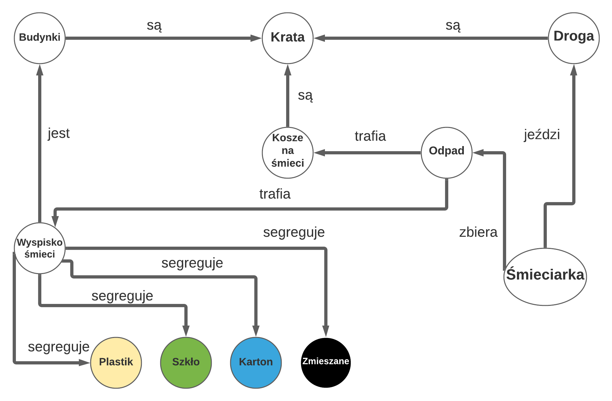

# Model sieci semantycznej


## Implementacja
* Śmieciarka zbiera odpady
``` 
def collect(self):
        trash_count = TRASH_COUNT
        trash_places = self.map.generate_trashes()
        while trash_count != 0:
            temp_trash_point = trash_places[0]
            temp_trash_point = self.points_grid[temp_trash_point.y][temp_trash_point.x]
            temp_trash = Trash(self.game, temp_trash_point)
            print("I am on my way to collect trash !")
            path_to_trash = self.roads_graph.A_star(self.points_grid, self.point, temp_trash_point)
            self.drive(path_to_trash)
            trash_count = trash_count - 1
            trash_places.remove(trash_places[0])
            temp_trash.deleteTrash()
```
[Player.py](../player.py)
* Śmieciarka jeździ po drodze
```
def drive(self, path):

        if not path:
            print("There is no possible road ! ")
            return

        current_point = path[0]
        path.remove(current_point)

        for point in path:
            dy = point.y - current_point.y
            dx = point.x - current_point.x
            current_point = point
            self.move(dx, dy)
            self.update()
            pygame.event.pump()
            time.sleep(TRUCK_SPEED)
            self.game.update()
            self.game.draw()
```
```
def move(self, dx=0,dy=0):

       # check if move is legal
       x_after_move = self.x + dx
       y_after_move = self.y + dy
       curr_position = [x_after_move, y_after_move]
       if 0 <= x_after_move < TILES_WIDTH and 0 <= y_after_move < TILES_HEIGHT:

        if(dx == 1):
            last_move = 'right'
            if self.points_grid[y_after_move][x_after_move].is_available:
                print("[ MOVE LOG ] MOVE RIGHT",end=" ")
                print(curr_position)
                self.x += dx

        if(dx == -1):
            last_move = 'left'
            if self.points_grid[y_after_move][x_after_move].is_available:
                print("[ MOVE LOG ] MOVE LEFT",end=" ")
                print(curr_position)
                self.x += dx

        if(dy == -1):
            last_move = 'up'
            if self.points_grid[y_after_move][x_after_move].is_available:
                print("[ MOVE LOG ] MOVE UP",end=" ")
                print(curr_position)
                self.y += dy

        if(dy == 1):
            last_move = 'down'
            if  self.points_grid[y_after_move][x_after_move].is_available:
                print("[ MOVE LOG ] MOVE DOWN",end=" ")
                print(curr_position)
                self.y += dy

        coordinates = [self.x, self.y]
        if coordinates in all_trash:
            self.empty_trash(coordinates)


        if(last_move == 'up' and self.degree != 90):
            if(self.image == self.image_3):
                if(self.degree == -90):
                    self.image = pg.transform.rotate(self.image,180)
                else:
                    self.image = pg.transform.rotate(self.image,90)
            else: 
                if(self.degree == -90):
                    self.image = pg.transform.rotate(self.image,-180)
                else: 
                    self.image = pg.transform.rotate(self.image,-90)
            self.degree = 90
        if(last_move == 'right'):
            self.image = self.image_3
            self.degree = 0
        if(last_move == 'left'):
            self.image = self.image_2
            self.degree = -180
        if(last_move == 'down' and self.degree != -90):
            if(self.image == self.image_3):
                if(self.degree==90):
                    self.image = pg.transform.rotate(self.image,-180)
                else:
                    self.image = pg.transform.rotate(self.image,-90)
            else:
                if(self.degree==90):
                    self.image = pg.transform.rotate(self.image,180)
                else:
                    self.image = pg.transform.rotate(self.image,90)
            self.degree = -90
```
[Player.py](../player.py)
* Odpady trafiają do koszy na śmieci
```
def generate_trashes(self):
        # get specified in setting amount of trashes
        places_to_populate = random.sample(self.trash_places, TRASH_COUNT)

        return places_to_populate
```
[Map.py](../map.py)
* Odpady trafiają na wysypisko śmieci
```
def empty_trash(self, coordinates):

        if coordinates == glass_position:
            settings.current_amount -= settings.glass_amount
            settings.glass_amount = 0
            self.trash_info()

        elif coordinates == bio_position:
            settings.current_amount -= settings.bio_amount
            settings.bio_amount = 0
            self.trash_info()

        elif coordinates == mixed_position:
            settings.current_amount -= settings.mixed_amount
            settings.mixed_amount = 0
            self.trash_info()

        elif coordinates == battery_position:
            settings.current_amount -= settings.battery_amount
            settings.battery_amount = 0
            self.trash_info()
```
[Player.py](../player.py)
* Plastiki, kartony, szkła oraz odpady zmieszane są segregowane
```
def deleteTrash(self):
        if (self.image == trashCanGreen):
            settings.glass_amount += 1
        elif (self.image == trashCanBlue):
            settings.paper_amount += 1
        elif (self.image == trashCanYellow):
            settings.plastic_amount += 1
        elif (self.image == trashCanBlack):
            settings.mixed_amount += 1
        self.kill()
```
[Trash.py](../trash.py)
* Droga jest na kracie -> City_3.tmx (Droga ma specjalne numery 899, 713, 750)
* Budynki są na kracie -> City_3.tmx (W warstwie 2 budynki są nakładane na kratę)
* Kosze na śmieci są na kracie -> City_3.tmx (Kosze na śmieci mają specjalny numer 891)
* Wysypisko jest budynkiem -> City_3.tmx (W warstwie 2 wysypisko znajduje się w warstwie z budynkami)

[City_3.tmx](../map/City_3.tmx)